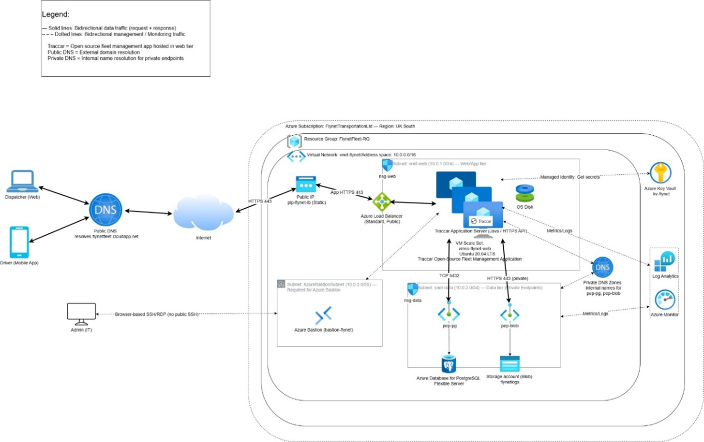
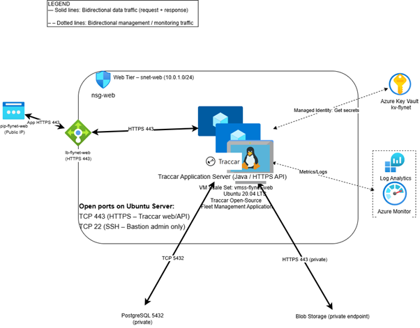
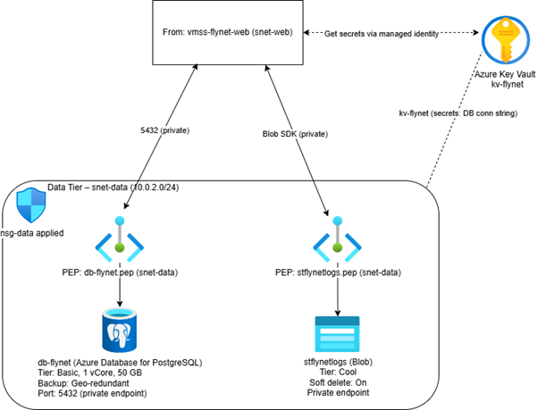
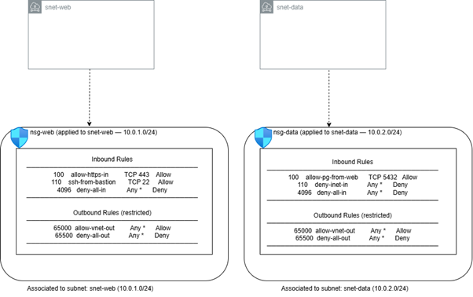
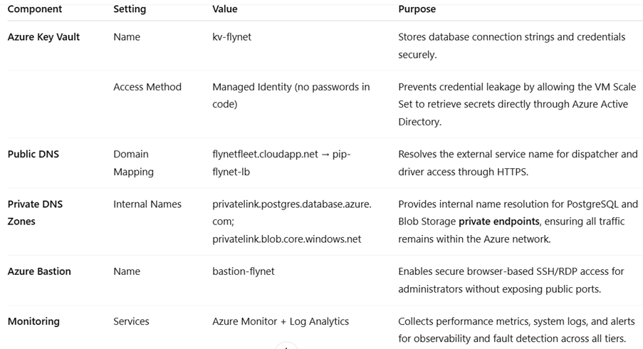
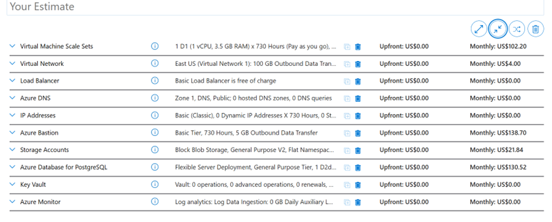

# ☁️ Azure Fleet Management Architecture

A cloud architecture design project developed as part of the BSc (Hons) Computing programme at Arden University.

The project designs a secure, scalable, and highly available fleet management solution for a transportation company using Microsoft Azure cloud services and industry-standard cloud architecture principles.

---

## 📋 Project Overview

This project presents a complete Azure-based infrastructure solution for a fleet management platform used by a transportation organisation.

The architecture was designed to provide:

* High availability
* Scalability
* Secure network segmentation
* Centralised monitoring
* Identity and access management
* Disaster recovery support
* Cost-effective cloud deployment

The solution demonstrates practical application of cloud computing concepts, Azure services, infrastructure design, and cloud security principles.

---

## 🚀 Key Features

### Network Architecture

* Azure Virtual Network (VNet)
* Multiple Subnets
* Network Security Groups (NSGs)
* Secure network segmentation
* Controlled traffic flow

### Compute Layer

* Azure Virtual Machine Scale Sets (VMSS)
* Automatic scaling
* Load balancing
* Fault tolerance

### Data Layer

* Azure Database for PostgreSQL
* Managed database services
* Secure connectivity
* Data persistence

### Storage

* Azure Blob Storage
* Document and media storage
* Scalable cloud storage

### Security

* Azure Key Vault
* Network Security Groups
* Principle of Least Privilege
* Identity and Access Management

### Monitoring & Operations

* Azure Monitor
* Log Analytics
* Performance monitoring
* Operational visibility

---

## 🏗️ Architecture Diagrams

### Overall Solution Architecture



### VM Scale Set Architecture



### Data Tier Architecture



### Security Architecture



### Monitoring Architecture



---

## 💰 Cost Estimation

The architecture includes Azure cost estimation and deployment planning to support practical implementation considerations.



---

## 🛠 Technologies & Services Used

### Microsoft Azure

* Azure Virtual Network
* Azure VM Scale Sets
* Azure Load Balancer
* Azure Database for PostgreSQL
* Azure Blob Storage
* Azure Key Vault
* Azure Monitor
* Azure Log Analytics

### Cloud Concepts

* Cloud Architecture Design
* Scalability
* High Availability
* Fault Tolerance
* Infrastructure Security
* Network Segmentation
* Monitoring & Observability

---

## 📚 Learning Outcomes Demonstrated

This project demonstrates practical knowledge of:

* Cloud Computing
* Microsoft Azure
* Infrastructure Design
* Cloud Security
* Network Architecture
* Scalability Planning
* Disaster Recovery Concepts
* Cost Evaluation
* Systems Design

---

## 📄 Project Documentation

Full project documentation is available in:

```text
documentation/azure-fleet-management-report.docx
```

---

## 🎓 Academic Context

This project was completed as part of the BSc (Hons) Computing degree at Arden University and demonstrates cloud architecture design skills relevant to cloud engineering, infrastructure, and solution architecture roles.

---

## 👩‍💻 Author

**Inna Bains**

BSc (Hons) Computing

Portfolio:
https://innabains.github.io/professional-portfolio/

LinkedIn:
https://www.linkedin.com/in/inna-bains-0aa890264

GitHub:
https://github.com/InnaBains

---

## 📜 License

This project is available under the MIT License.

